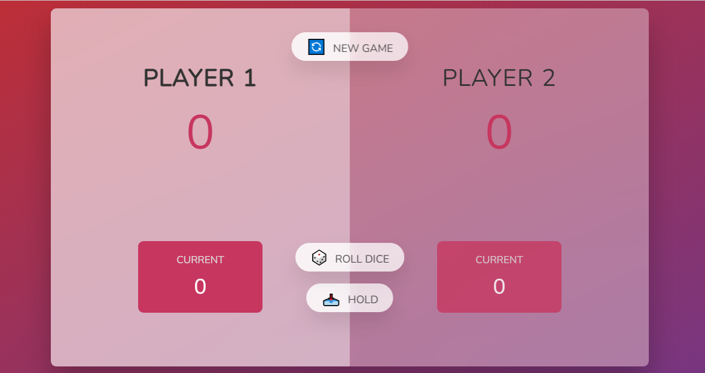

# Pig-Game

  <h3 align="center">Pig Game</h3>

  
 
    <a href="https://github.com/harshbutani1801/Pig-Game"><strong>Explore the docs »</strong></a>
     
     
    <a href="https://github.com/harshbutani1801/Pig-Game">View Demo</a>
    ·
    <a href="https://github.com/harshbutani1801/Pig-Game/issues">Report Bug</a>
    ·
    <a href="https://github.com/harshbutani1801/Pig-Game/issues">Request Feature</a>
  

<!-- ABOUT THE PROJECT -->
## About The Project

I have developed a game using HTML, CSS and JavaScript. This is a basic game which is played by 2 players.

You may also suggest changes by forking this repo and creating a pull request or opening an issue. Thanks to all the people have contributed to expanding this template!

Use `index.html` to get started with frontend.

Use `script.js` to get started with backened.

### Built With

This section will let you know from what this application is built

* [VSCode](https://code.visualstudio.com/) `IDE`
* [HTML](https://html.com/) `Frontened Language`
* [CSS](https://css-tricks.com/) `Frontened Code`
* [JS](https://www.javascript.com/) `Backened Code`

